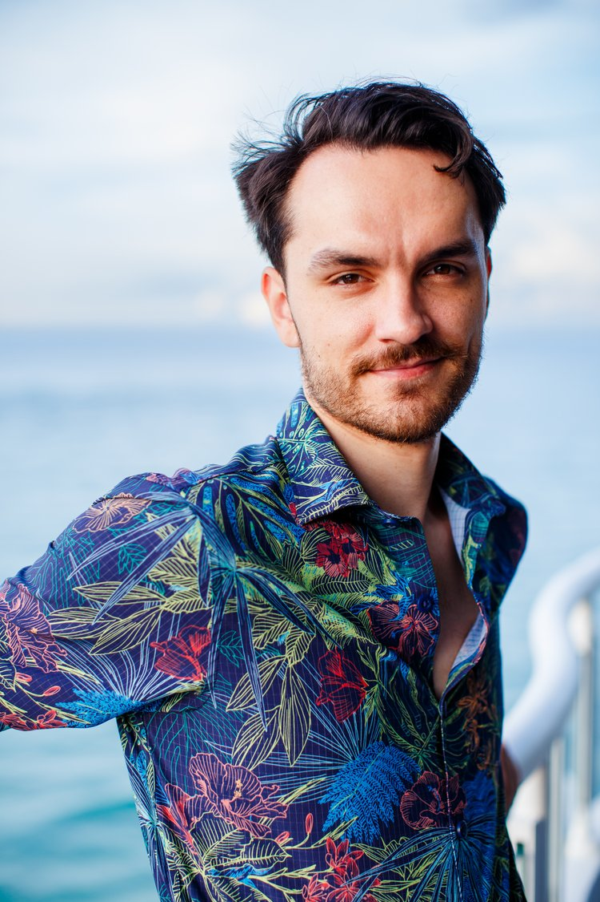

# About the Author

<!-- prettier-ignore -->

A few years ago, I was barely surviving.

It started long before the dry spell. I grew up with a victim mentality — stories about being small, powerless, not enough — installed so early I didn't know they were stories. They felt like reality. By the time I was an adult, one belief ran everything: I'm unworthy, and anyone who really sees me will see that and reject me. That belief made me so afraid that I stopped taking action — and that's what created seven years without sex, intimacy, or touch. Not bad luck. Not being unattractive. One invisible belief, keeping me frozen. Panic attacks that lasted eight hours, every other day. Anxiety around worth and rejection so severe I could barely function. I was borderline suicidal, overwhelmed with intrusive thoughts I'd never experienced before. I genuinely believed I was the most hopeless case I'd ever seen.

I was blind. Completely blind — to the beliefs running my life, to the stories I was telling myself, to the invisible patterns keeping me trapped. And because I couldn't see them, I couldn't change them. I just suffered and called it fate.

I went to therapy — five hours a week for over a year. It helped me understand things intellectually, but it didn't change the beliefs underneath. You can talk about being lovable every session — but until someone actually shows you love, your body doesn't trust it. The mind might update, but the body holds the old story. That's when I realized: you can't think your way out of trauma. You have to live your way out. If the beliefs destroying me were about worth and being wanted, I needed experiences where those beliefs would be tested — not more conversations about them.

So I tried everything. I went to my first play party, terrified — not because of the party, but because rejection felt like walking into fire. Every "no" confirmed the story I'd been carrying: *I'm unlovable. No one will ever want me.* I discovered conscious sexuality communities. I started attending as self-directed exposure therapy — crying at some events, connecting at others, learning at all of them. Each experience taught me something. Each risk built evidence that I could create the life I wanted.

That's also where I learned to see patterns — not from textbooks, but in the field. Every partnered exercise, every conversation with a stranger, every moment of connection or conflict was a live laboratory. I could watch my own stories come up in real-time, and I could see other people's stories playing out right in front of me. Hundreds of interactions, compressed into intense environments where everything is amplified. That's how you get good at this fast.

The childhood beliefs that made me feel small — they were the same beliefs that created the dry spell, the panic attacks, the paralysis around women. It was all one thread. Once I could see it, I could pull it. And once the first invisible belief came loose, I started finding them everywhere — around money, worth, safety, power, all of it. The external changes followed on their own.

I used to think I was fragile — struggles in school, a body that protests past two to four hours a day of willpower-driven work. And a pattern I still haven't fully explained: every so often, the work just stops. Days, sometimes longer. I don't know why. I made all of it mean I was broken. Who hires someone with random downtimes? I can't hold a job. I'll never be able to take care of myself. I spent years forcing myself to do what hurts and doesn't work.

Then I saw through the belief underneath all of it: that I *have* to work eight hours a day, every day, like everyone else. If my body is happy at two to three hours, then I'm forced to create a thousand dollars of value per hour and have a lot of free time. Oh no. What a curse. And the downtimes? Then I build work that serves people hard on the up-times instead of renting myself out as a machine I'm not.

Notice what changed and what didn't. The downtimes still come. I still haven't solved them. I didn't need to. Same facts, same body — but without the belief, I'm happier and accomplishing more than I ever would have grinding eight hours like everyone else. The facts never meant *broken.* The belief did. You don't have to fix the fact to remove the story about it.

You can hear the change in the language. I used to say *I can't.* Now I say *I don't know how yet.* The first is a verdict — the case is closed, the search is over. The second is a fact with a door in it: there's a way, I haven't found it, and not having found it doesn't even stop me. That's what changing one limiting belief can do.

Today, I work as a Seer. I see the invisible beliefs running people's lives — the puppet strings they don't know are there — and I show them how to cut them. Sex and intimacy are a specialty, but the skill applies everywhere: money, confidence, relationships, identity under crisis. The machinery is the same.

**I wrote this book because I know what it's like to be on both sides.**

I've made mistakes in these spaces. I've been accused of things I didn't do. I've fawned when I should have set boundaries. I've watched people destroy each other with witch hunts based on vibes instead of facts. And I've learned — the hard way — how to navigate all of it with more clarity and less harm.

Play parties, tantra workshops, conscious sexuality spaces — they have so much going for them. But when conflict arises — when someone cries victim, when accusations fly, when mistakes get treated like malice — most people have no framework. They just react from fear, trauma, and mob instinct. **This is the single area where our communities need the most help.** And nobody was teaching it.

So I built this. Everything here comes from lived experience — years of navigating these spaces, seeing the patterns most people miss, and learning from both sides of every dynamic. This is the framework I wish everyone had.

The path that led to this book started taking shape when [Laurie Handlers](https://lauriehandlers.com/) — bestselling author and leading international voice in sexuality, intimacy, and relationships — invited me into her world. What she taught me was the foundation. What I saw from there became this book.

### Training & Background

- [Somatica Institute](https://www.somaticainstitute.com/) Core Training (AASECT-approved)
- [Laurie Handlers'](https://lauriehandlers.com/) Sex & Happiness Apprenticeship
- Week-long [ISTA](https://ista.life/) retreats and intensive containers
- Staff and assistant roles at retreats and play parties
- 2+ years of weekly workshops, play parties, and immersive practice
- [Tony Robbins](https://www.tonyrobbins.com/) Platinum Partnership
- [Landmark Forum](https://www.landmarkworldwide.com/)

### Want to Go Deeper?

If something in this book hit home — if you recognized a pattern in yourself, a belief you didn't know you had, a string you want to cut — I work with people 1-on-1.

**Learn more:** [sloganking.github.io/coaching](https://sloganking.github.io/coaching/)

---

*— Logan King* 👑